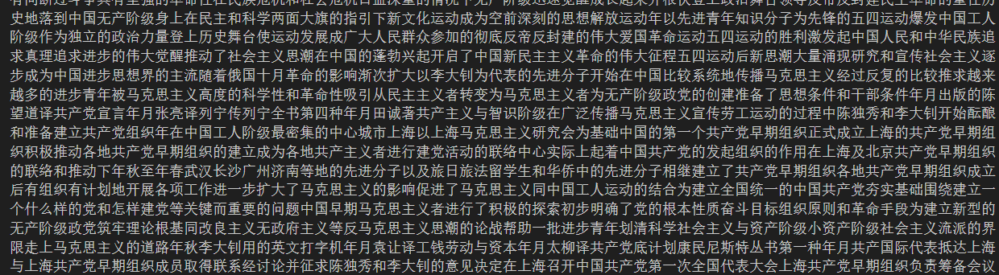
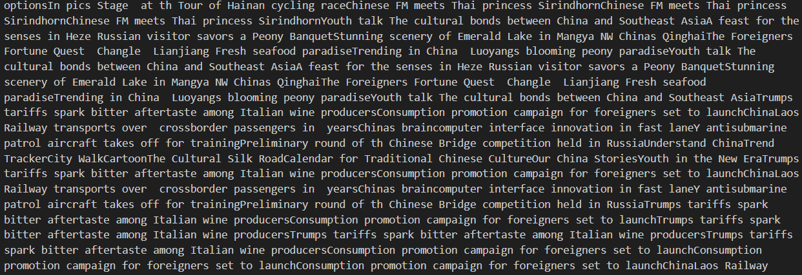
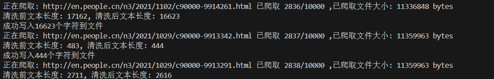
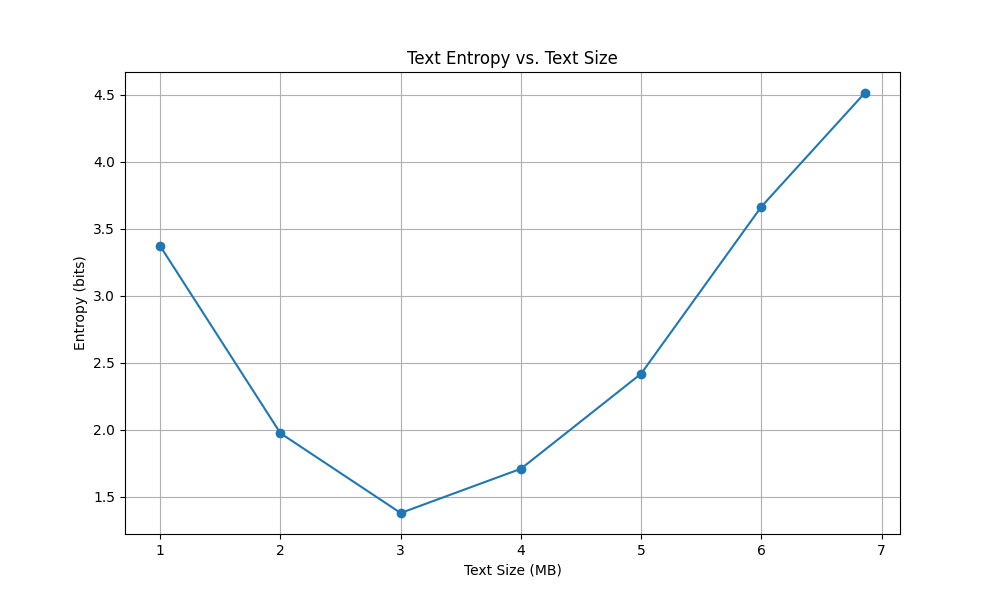
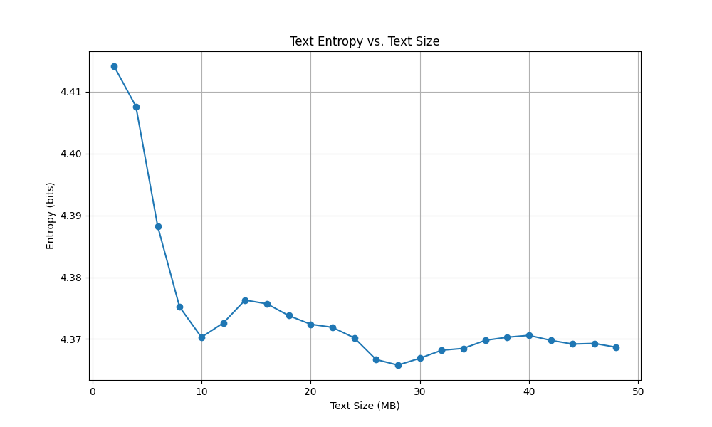

# 自然语言处理第一次作业实验报告

朱辰 2022k8009970002

## 实验内容

网络爬虫：计算中英文本的熵

分别收集尽量多的英语和汉语文本，编写程序计算这些文本中英语字母和汉字的熵，对比本章课件第18页上表中给出的结果。然后逐步扩大文本规模，如每次增加固定的数量，如2M/5M等，重新计算文本规模扩大之后的熵，分析多次增加之后熵的变化情况。

## 爬虫

爬虫部分使用了`requests`和`BeautifulSoup`库来抓取网页数据。数据来源是人民网的中文与英文版[http://www.people.com.cn/](http://www.people.com.cn/)和[http://en.people.cn/](http://en.people.cn/)。

具体代码见`crawler.py`文件。

### 核心流程分析

1. 整体流程：
   - 访问网页，获取网页内容
   - 解析网页内容，提取文本
   - 清洗文本，去除多余的空格和换行符
   - 将文本保存到文件中
   - 提取超链接并加入队列

2. 获取网页内容：
   使用了`requests`库的`get`方法来获取网页内容，并使用`BeautifulSoup`库解析HTML文档。
    ```python
    response = requests.get(url, headers=self.headers, timeout=10)
    self.visited_urls.add(url)
                
    if response.status_code == 200:
        soup = BeautifulSoup(response.text, 'html.parser')
    ```

3. 解析网页内容：
   使用`BeautifulSoup`库解析HTML文档，提取文本内容。
    ```python
    def extract_text(self, soup):
        """提取网页中的所有文本内容"""
        for script in soup(["script", "style"]):
            script.decompose()
        
        # 获取所有文本
        news = ''
        title = soup.title.text.strip() if soup.title else ''
        news += title
        for x in soup.find_all('div'):
            for y in x.find_all('p'):
                news += y.text.strip()
        
        return news
     ```

4. 清洗文本：
   使用正则表达式去除多余的空格和换行符。

```python
def clean_text(self, text, keep_english=True, keep_chinese=True):
    """清洗文本，去除多余空格，并根据参数保留英文或中文"""
    text = re.sub(r'\s+', ' ', text).strip()
    
    result = ""
    if keep_english and keep_chinese:
        result = text
    elif keep_english:
        result = re.sub(r'[^a-zA-Z\s]', '', text)
    elif keep_chinese:
        result = re.sub(r'[^\u4e00-\u9fff\s]', '', text)
    
    # 输出清洗前后的文本长度
    print(f"清洗前文本长度: {len(text)}, 清洗后文本长度: {len(result)}")

    return result
```

5. 提取超链接并加入队列

```python
def get_links(self, url, soup):
    """从网页中提取所有超链接并返回绝对URL"""
    links = []
    for link in soup.find_all('a', href=True):
        href = link['href']
        absolute_url = urllib.parse.urljoin(url, href)
        # 过滤非http链接
        if absolute_url.startswith('http'):
            links.append(absolute_url)
    return links
```

同时维护一个队列，存储待爬取的链接。每次从队列中取出一个链接进行爬取，直到达到设定的爬取数量。爬取完成后，将从该链接中提取的超链接加入队列中。

```python
while queue and page_count < self.max_pages:
    ...
    url = queue.popleft()
    
    if url in self.visited_urls:
        continue

    ... #其它部分

    links = self.get_links(url, soup)
    for link in links:
        if link not in self.visited_urls:
            queue.append(link)
    
    page_count += 1
```

### 一些发现与思考

1. 黑名单设置

在爬取过程中，发现爬取网站中存在一些视频或者文档链接，这些链接并不包含文本内容。并且这些链接的内容通常较大，会严重拖慢爬取速度。为了避免这种情况，可以在爬取前设置一个黑名单，过滤掉这些链接。

```python
blacklist = ['video', 'pdf', 'download', 'doc', 'xls', 'ppt', 'mp3', 'mp4']
# 如果url里含有被黑名单字符串，跳过
if any(black in url for black in blacklist):
    print(f"跳过黑名单URL: {url}")
    continue
```

2. 提取文本使用函数的选择

一开始，我直接使用了`BeautifulSoup`的`get_text()`方法来提取文本内容，但发现提取的文本并不完整，有时明明该网页有内容却提取不到。经过调试，发现`get_text()`方法会忽略一些标签内的文本内容，因此我决定使用ppt中的方法手动选择标签。

3. 无效链接的处理

经过对爬虫部分的观察，发现由于在爬取时对所有链接都进行了爬取，导致爬取的链接有大量不符合要求的链接，如人民网以外的站点和人民网其它语言的站点，猜测来源于类似“友情链接”之类的超链接或者新闻里为了引用而添加的链接。

因此仿照黑名单机制，设置一个白名单，只爬取人民网对应语言的链接。同时对欸名单进行了一定的扩展，增加了其它语言的部分

```python
blacklist = ['video', 'pdf', 'download', 'doc', 'xls', 'ppt', 'mp3', 'mp4','swahili','italian' , 'kaz', 'thai', 'malay', 'greek','vietnamese','urdu','hindi']
# 如果url里含有被黑名单字符串，跳过
if any(black in url for black in blacklist):
    print(f"跳过黑名单URL: {url}")
    continue

if not keep_english:
    whitelist =['people']
else:
    whitelist = ['en.people']
# 如果url里不含有白名单字符串，跳过
if not any(white in url for white in whitelist):
    print(f"跳过非白名单URL: {url}")
    continue
```


## 熵的计算

这一部分使用`collections.Counter`来统计字符频率，然后计算熵。使用`pandas`和`matplotlib`来可视化熵的变化。

出于方便考虑，我并没有采用改变爬取文本大小的方式来控制文本大小，而是直接爬取大量文本，然后在数据处理时进行分割。

具体代码见`analyze.py`文件。

### 核心流程分析

1. 整体流程：
   - 读取文本文件
   - 选择文本量
   - 统计字符频率
   - 计算熵
   - 可视化熵的变化

2. 统计字符频率与计算熵：

```python
def calculate_entropy(text):
    # 计算文本熵
    counter = Counter(text)
    length = len(text)
    probabilities = [count / length for count in counter.values()]
    entropy = -sum(p * math.log2(p) for p in probabilities)
    return entropy
```

3. 控制文本量：

```python
# 计算不同文本量下的熵
results = []
for i in range(step_size, len(text) + 1, step_size):
    sample = text[:i]
    size_mb = i / (1024 * 1024)
    entropy = calculate_entropy(sample)
    results.append({'Size (MB)': round(size_mb, 2), 'Entropy (bits)': round(entropy, 4)})
    
# 如果最后一个样本不是整数倍step_size
if len(text) % step_size != 0:
    sample = text
    size_mb = len(text) / (1024 * 1024)
    entropy = calculate_entropy(sample)
    results.append({'Size (MB)': round(size_mb, 2), 'Entropy (bits)': round(entropy, 4)})
```


## 结果与分析

### 1. 文本爬取结果

通过控制`max_pages`参数,设置其值为中文15000英文10000，即对于每个语言爬取10000个网页。
爬取完成后，分别得到了中文和英文的文本数据，大小分别为：
- 中文文本：约6.86 MB
- 英文文本：约47.9 MB

爬取内容展示：

- 中文


- 英文


- 运行时截图


具体爬取的文本数据存储在`result_CH.txt`和`result_EN.txt`文件中。

### 2. 熵的计算结果

通过对爬取的文本进行熵的计算，得到了不同文本量下的熵值。

中文：

英文：

最终在最大文本量下，中文和英文的熵值分别为：
- 中文：4.5117 bits
- 英文：4.3687 bits

与文献结果相比，中文的熵值低于课件中的结果，英文的熵值基本相同

具体结果见`analysis_EN/`和`analysis_CH/`目录中内容

### 结果分析

对于中文，随着文本量的增加，熵值仍在增加，且波动幅度较大

对于中文文本熵值明显小于文献值的猜测：

1. 爬取数据量较小，可以看到，随着数据量增加，熵值仍在增加，若继续增加数据量，熵值可能会接近文献值
2. 文本来源于人民网，人民网的文本内容相对单一，可能导致熵值偏低，比如经过观察，人民网报道中一些常用的词语如“人民”、“中国”等出现频率较高，导致熵值偏低
3. 数据未清晰干净，存在例如“年/月/日”等非正文内容，可能导致熵值偏低

值得注意的是，尽管爬取中文的网页数大于英文，但中文文本的大小却显著小于英文文本的大小，这一点可能是由于所爬取网站（人民网）的内容差异造成的。

对于英文，随着文本量的增加，熵值逐渐趋于稳定，且波动幅度始终不大，说明英文文本的字符分布相对均匀。