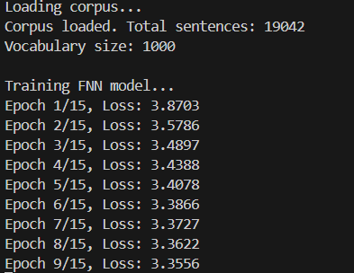
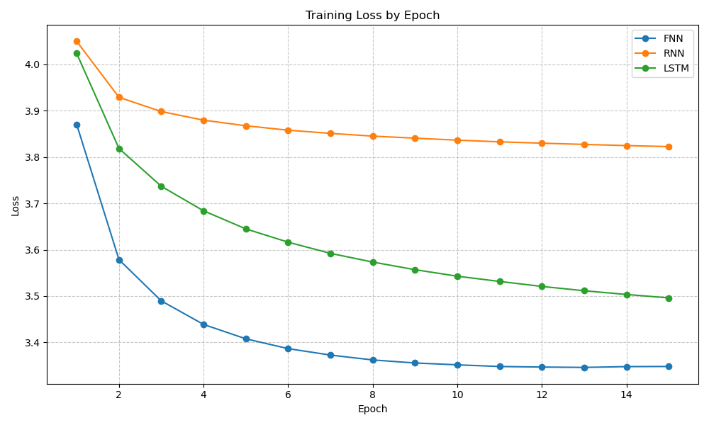
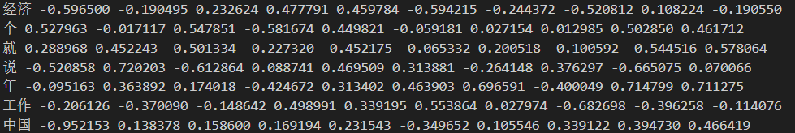
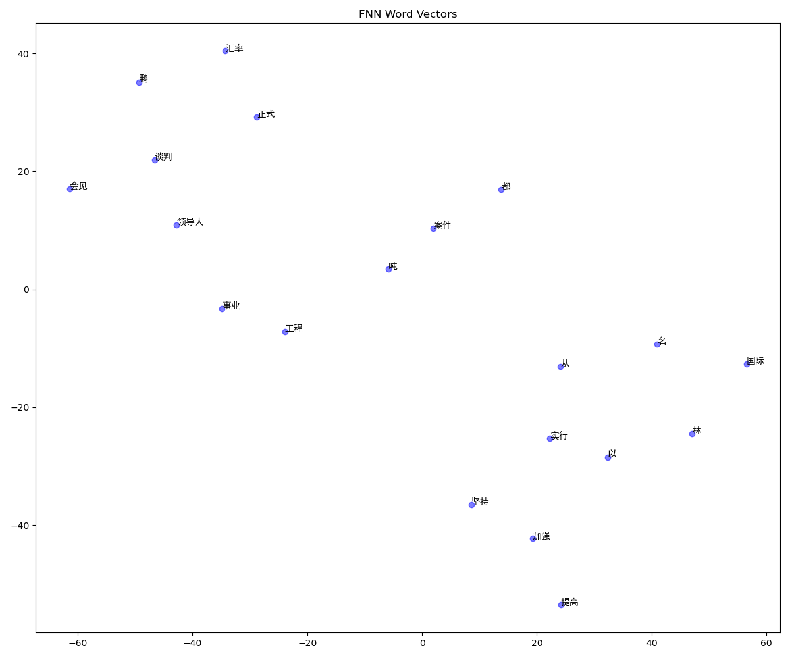
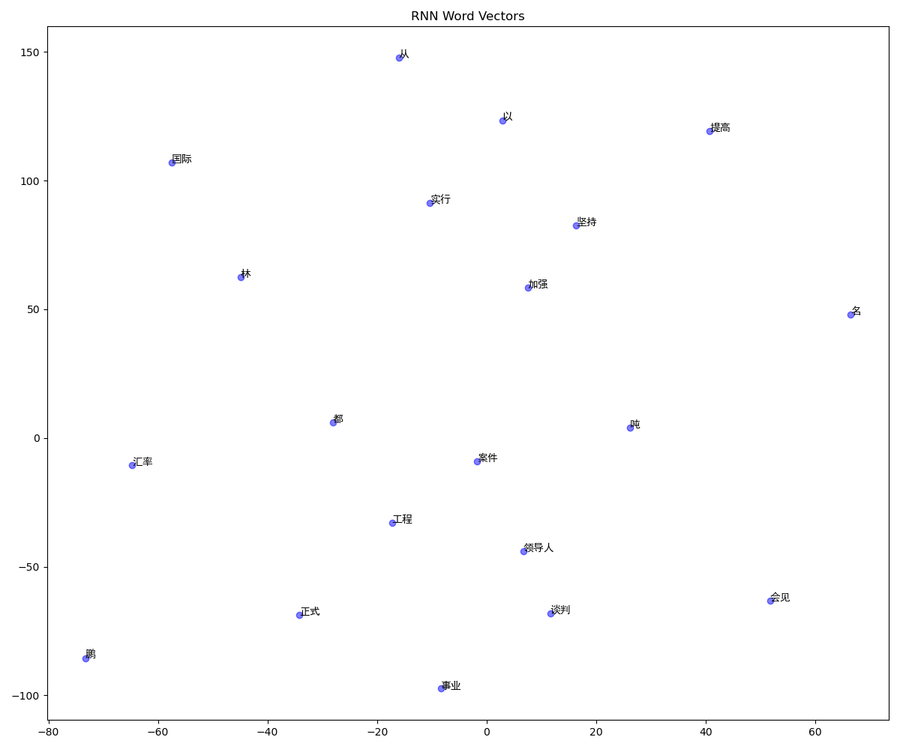
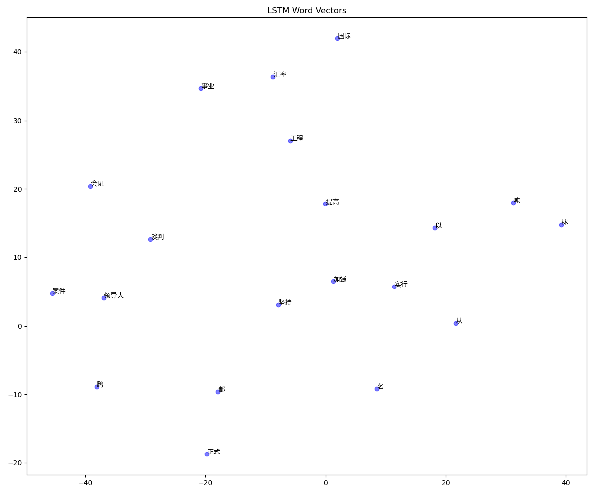

# 自然语言处理第二次作业实验报告

朱辰 2022k8009970002

基于pytorch的中文词向量计算

## 实验内容

利用北京大学标注的《人民日报》1998年1月份的分词语料，基于pyTorch分别实现FNN、RNN和LSTM模型，完成如下任务：

1. 获得汉语的词向量。
2. 随机选择20个单词，计算与其词向量最相似的前10个单词。
3. 对比FNN、RNN和LSTM模型获得的词向量的差异。

关于项目的详细介绍和使用方法，请参考[README.md](../README.md)。

## 数据处理

课程网站中提供的中文语料为GB2312编码格式，直接使用会导致许多中文字符的乱码，因此需要将其转换为utf-8编码格式。

转化完成后，利用`process.py`中的`process_data`函数对数据进行预处理，统计出词频，并将词频较高的1000个词汇加入到词表中(具体数字可以在`config.yaml`中修改)，其余词汇用`<UNK>`表示。

之后在`load.py`中定义了`load_data`函数，将原始文本转化为处理后的文本，并将每个词汇映射到一个唯一的索引，并返回词表和索引映射。

值得注意的是，这一过程需要跳过忽略标点符号(w)和虚词(u)等词汇。


## 模型实现

pytorch提供了丰富的神经网络模块，可以方便地构建各种类型的神经网络。

对于FNN模型，我们可以使用 `torch.nn`模块中的`Linear`类来定义前馈神经网络的线性层

```python
class FNN(nn.Module):
    def __init__(self, vocab_size, embedding_dim, context_size=2, hidden_dim=100):
        super(FNN, self).__init__()
        actual_context_size = 2 * context_size  # 左右各context_size个词
        self.embeddings = nn.Embedding(vocab_size, embedding_dim)
        self.linear1 = nn.Linear(actual_context_size * embedding_dim, hidden_dim)
        self.linear2 = nn.Linear(hidden_dim, vocab_size)
```

对于RNN和LSTM模型，pytorch均已经有相关的实现，可以通过`torch.nn`模块中对应类来定义模型结构。

```python
class RNN(nn.Module):
    def __init__(self, vocab_size, embedding_dim, hidden_dim=100):
        super(RNN, self).__init__()
        self.embeddings = nn.Embedding(vocab_size, embedding_dim)
        self.rnn = nn.RNN(embedding_dim, hidden_dim, batch_first=True)
        self.linear = nn.Linear(hidden_dim, vocab_size)
```

```python
class LSTM(nn.Module):
    def __init__(self, vocab_size, embedding_dim, hidden_dim=100):
        super(LSTM, self).__init__()
        self.embeddings = nn.Embedding(vocab_size, embedding_dim)
        self.lstm = nn.LSTM(embedding_dim, hidden_dim, batch_first=True)
        self.linear = nn.Linear(hidden_dim, vocab_size)
```

之后根据模型的不同，定义不同的权重初始化和前向传播方法即可，下面以RNN模型为例

```python
    def init_weights(self):
        """初始化模型权重"""
        # 嵌入层使用均匀分布初始化
        initrange = 0.5 / self.embeddings.embedding_dim
        self.embeddings.weight.data.uniform_(-initrange, initrange)
        
        # RNN 权重使用 Kaiming 初始化
        nn.init.kaiming_normal_(self.rnn.weight_ih_l0, nonlinearity='tanh')
        nn.init.orthogonal_(self.rnn.weight_hh_l0)  # 对于循环连接权重，使用正交初始化
        self.rnn.bias_ih_l0.data.zero_()
        self.rnn.bias_hh_l0.data.zero_()
        
        # 线性层使用 Kaiming 初始化
        nn.init.kaiming_normal_(self.linear.weight, nonlinearity='relu')
        self.linear.bias.data.zero_()

    def forward(self, input):
        """前向传播"""
        # input 形状为 [batch_size, seq_len]
        embeds = self.embeddings(input)  # [batch_size, seq_len, embedding_dim]
        rnn_out, _ = self.rnn(embeds)    # [batch_size, seq_len, hidden_dim]
        out = self.linear(rnn_out[:, -1, :])  # 取最后一个时间步的输出
        log_probs = F.log_softmax(out, dim=1)
        return log_probs
```

## 结果生成

在`main.py`中定义了训练和测试的函数，训练完成后会将模型参数,训练得到的词向量保存到`results/`文件夹中

为了可视化词向量，使用`sklearn`中的`TSNE`方法将选择的词向量降维到2维，并使用`matplotlib`进行可视化。

同时，根据任务要求，随机选择了词汇表中的20个词汇，计算与其词向量最相似的前10个词，并将结果保存到`results/similar_words.txt`中。

为了对比不同模型的词向量差异，使用`cosine_similarity`计算不同模型的词向量之间的相似度，并将结果保存到`results/vector_comparison.txt`中。

例行的训练损失曲线图和数据也会保存到`results/`文件夹中。

## 杂项

为了方便参数的设置和修改，使用了`yaml`格式的配置文件`config.yaml`，可以在其中设置模型参数、训练参数等。具体内容可见`config.yaml`文件中的注释。

## 实验结果与分析

### 程序运行

程序正常运行，运行时截图如下：



具体运行的参数可在`config.yaml`中查看。

完整的一次训练在NVIDIA GeForce RTX 3060 Laptop GPU上大约需要数十分钟，建议复现时将`epoch`设置为较小的值(如5)进行测试。

最终训练损失曲线如下：



可以看懂到，随着训练的进行，损失逐渐减小，并趋于平稳，说明模型在不断学习和优化。

### 词向量(任务一)

得到的词向量部分结果以及可视化图如下









完整的词向量结果保存在`results/word_vectors`中。

可以看到，成功获得了词向量。然而，实验之初的预期是能通过生成的散点图直观地评判生成的结果。但由于随机选择的词汇较少以及之间的关联性较弱，可视化的结果并不能很好的展示词向量结果的质量，需要手动进行分析。但仍能看到一些词汇之间的关联，例如FNN中“正式”“谈判”“会见”“领导人”等词汇聚集在一起，说明它们之间有一定的语义关系。

### 词向量相似度(任务二)

根据任务要求，随机选择了20个词汇，计算与其词向量最相似的前10个词，并将结果保存到`results/similar_words.txt`中。

以词汇“提高”为例，计算得到的相似词汇如下：

FNN:

    Word: 提高
        增强: 0.9739
        培养: 0.8820
        深化: 0.8258
        丰富: 0.8015
        改善: 0.7727
        加快: 0.7600
        加大: 0.7518
        发挥: 0.7499
        使: 0.7457
        促进: 0.7434

RNN:

    Word: 提高
        意识: 0.8218
        学: 0.8158
        抓: 0.8129
        先进: 0.7851
        增强: 0.7819
        保障: 0.7740
        特色: 0.7688
        做好: 0.7593
        宣传: 0.7560
        反映: 0.7529

LSTM:

    Word: 提高
        改善: 0.8714
        增强: 0.8614
        完善: 0.7958
        促进: 0.7905
        改造: 0.7792
        推进: 0.7720
        保障: 0.7567
        增加: 0.7461
        调整: 0.7320
        加大: 0.7305

可以看到，三个模型计算得到的相似词汇有一定的差异，FNN和LSTM模型计算得到的相似词汇较为接近，且能较好地反映出“提高”这个词的语义关系。而RNN模型计算得到的相似词汇则与“提高”这个词的语义关系较弱。这可能是由于RNN模型在处理长序列时容易出现梯度消失或爆炸的问题，导致模型无法很好地捕捉到词汇之间的关系。

与理论预期相符的是，LSTM在这一任务中的表现最好，所得到的相似词汇与“提高”这个词的语义关系最强

### 词向量对比(任务三)

根据任务要求，计算不同模型的词向量之间的差异(以余弦值的形式表示)，并将结果保存到`results/vector_comparison.txt`中。

部分结果如下

```

Word: 领导人
  FNN vs RNN: -0.0970
  FNN vs LSTM: -0.0482
  RNN vs LSTM: 0.6083

Word: 实行
  FNN vs RNN: 0.6027
  FNN vs LSTM: 0.1326
  RNN vs LSTM: 0.2548

Word: 事业
  FNN vs RNN: 0.0564
  FNN vs LSTM: 0.1056
  RNN vs LSTM: 0.0846

Word: 坚持
  FNN vs RNN: -0.1621
  FNN vs LSTM: 0.2209
  RNN vs LSTM: -0.1845

Word: 工程
  FNN vs RNN: 0.2472
  FNN vs LSTM: 0.2055
  RNN vs LSTM: -0.0441
```

尽管能得到对应的余弦值，但由于词向量的数值本身并无意义，因此无法直接判断其好坏。相比较来说，使用任务一中的可视化方法并精心选择一部分词汇或许是个更好的选择。

