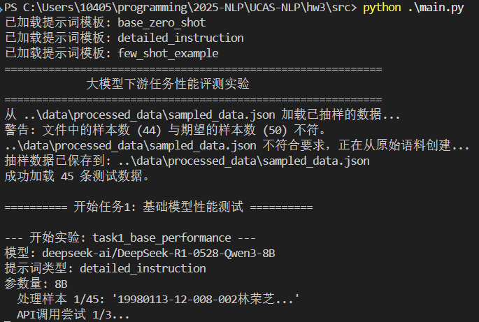
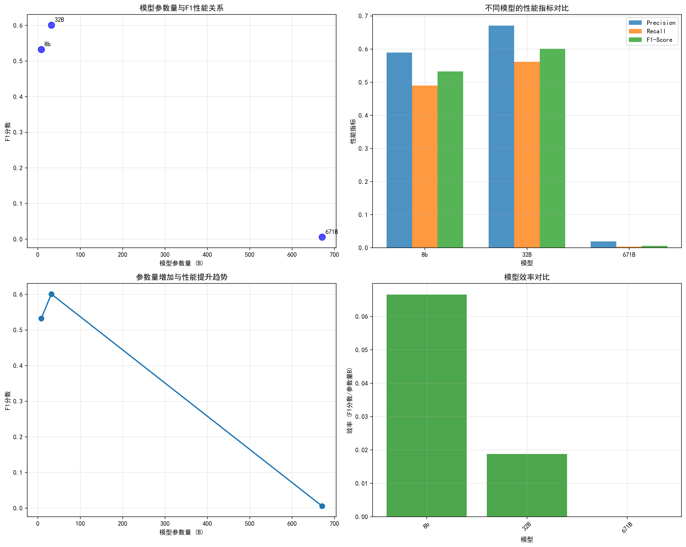
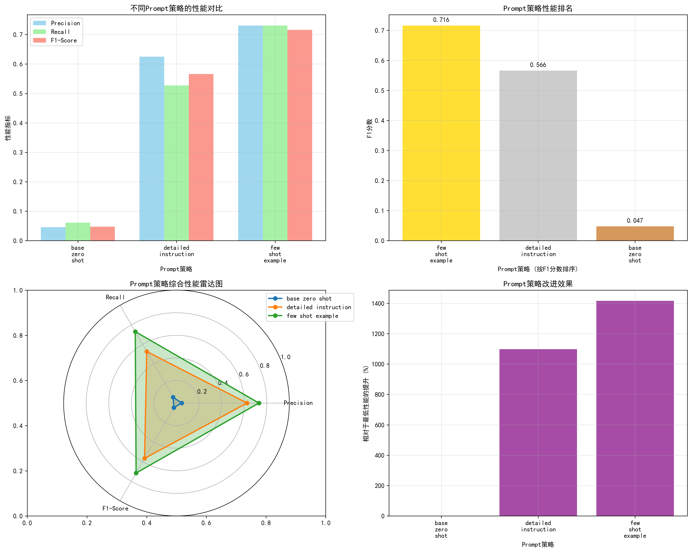
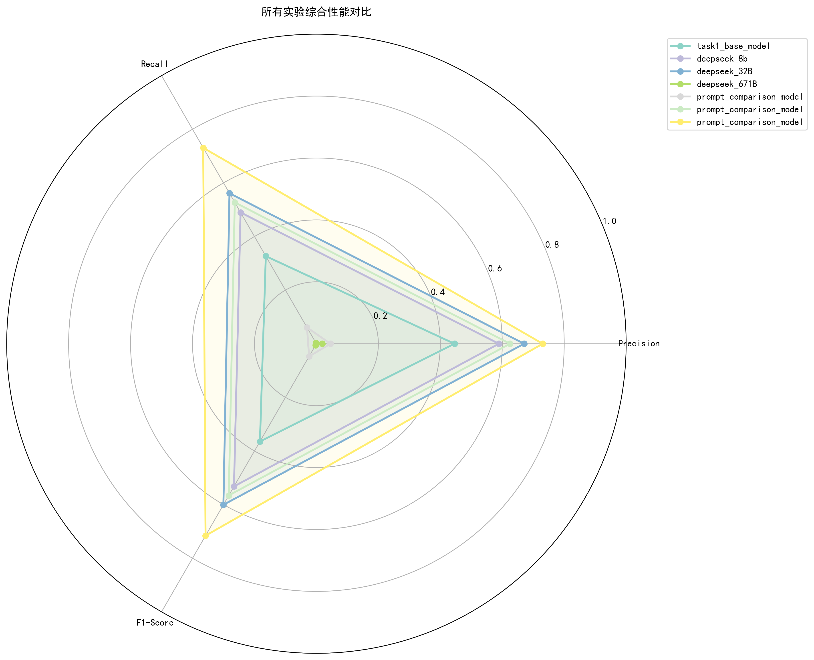
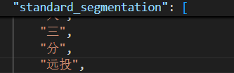

# 自然语言处理第三次作业实验报告

朱辰 2022k8009970002

大模型下游任务性能评测

## 实验内容

利用北京大学标注的《人民日报》1998年1月份的分词语料，借助外部网站部署的大模型API完成如下任务：

1) 测试并计算一个大模型在随机抽取的50条数据上的平均分词性能；

2) 对于同一批数据，对比分析大模型的参数量大小、提示词(Prompt)等因素对大模型分词性能的影响；

3) 基于上面任务的结果，总结分析提升大模型在分词等下游任务上性能的方法。 

关于项目的详细介绍和使用方法，请参考[README.md](../README.md)。

## 数据处理

本次实验已经有了实验二的经验，数据处理的过程相对简单。照例转换编码后，使用`process.py`中的`process_data`函数对数据进行预处理，将结果转换为json形式存储。

处理后的数据形式如下

```json
{
        "original_sentence": "19980116-01-007-001尉健行在全国精神文明建设工作会议上强调坚持不懈加强精神文明建设",
        "standard_segmentation": [
            "19980116-01-007-001",
            "尉",
            "健行",
            "在",
            "全国",
            "精神文明",
            "建设",
            "工作",
            "会议",
            "上",
            "强调",
            "坚持不懈",
            "加强",
            "精神文明",
            "建设"
        ]
},
```

## api调用

本次实验使用了[SiliconFlow](https://www.siliconflow.cn)提供的API。

具体api调用方法参考了官方文档,详细代码见`llm_caller.py`。

由于调用api可能出现的问题较多，因此在这一过程中尤其注重了异常处理。

为了方便后续更换不同的模型和提示词，在`llm_caller.py`中并没有定义具体的模型和提示词，而是通过外部输入的方式传入。

出于安全和隐私的保护，API密钥等敏感信息存储在`configs/api_config.yaml`中，并加入了`.gitignore`文件，避免泄露。如需复现，需要自行创建并填写自己的api密钥。

## 实验运行

实验的主体代码在`main.py`中。流程如下：

1. 读取配置文件`configs/exp_config.yaml`，获取实验参数，包括模型名称、提示词等。
2. 读取API密钥配置文件`configs/api_config.yaml`。
3. 读取处理后的数据样本`data/processed_data/sampled_data.json`，如果不存在或者需要更新，则调用`data_process.py`中的`process_data`函数进行处理。
4. 对于每一个实验中的每一个子项，进行以下步骤：
   1. 调用`llm_caller.py`中的`get_llm_segmentation`函数，使用指定的模型和提示词对数据进行分词处理。
   2. 调用`evaluator.py`中的`calculate_metrics`函数，对模型输出的分词结果进行评估，计算准确率、召回率和F1值。
   3. 将评估结果保存到`results/`目录下，并打印输出。
   4. 如果配置了可视化选项，则调用`visualizer.py`中的`visualize_results`函数进行结果可视化，并保存到`results/visualizations/`目录下。


### 运行过程

运行时的控制台截图



## 实验配置

本次实验使用的模型均为deepseek(671B使用的是DeepSeek-R1，其它是QWen蒸馏后的结果)，具体使用的模型如下：

- deepseek-ai/DeepSeek-R1-0528-Qwen3-8B
- deepseek-ai/DeepSeek-R1-Distill-Qwen-32B
- deepseek-ai/DeepSeek-R1

对于提示词，共设计了三种，分别是：

- `base_zero_shot.txt`：基础零-shot提示词

```
分词：{sentence}
```

- `few_shot_example.txt`：few-shot示例提示词

```
请对下面的中文句子进行分词，用空格分隔每个词。

示例1：
输入：中共中央总书记、国家主席江泽民
输出：中共中央总书记 、 国家 主席 江 泽民 

示例2：
输入：梁军是新中国的第一个女拖拉机手
输出：梁 军 是 新 中国 的 第一 个 女 拖拉机 手


现在请对以下句子进行分词：
输入：{sentence}
输出：
```

- `detailed_instruction.txt`：详细指令提示词

```
你是一个专业的中文分词专家，请严格按照以下规则对给定句子进行分词：

分词规则：
1. 准确分割句子，确保每个词汇单位有意义。
2. 遵循现代汉语语法规范和语言学标准。
3. 保持词汇的语义完整性和语法功能。
4. 专有名词和复合词需保持完整，不拆分。
5. 输出格式：词与词之间用单个空格分隔。
6. 不添加任何标点符号、序号或其他额外符号。

示例1：
输入：中共中央总书记、国家主席江泽民
输出：中共中央总书记 、 国家 主席 江 泽民 

示例2：
输入：梁军是新中国的第一个女拖拉机手
输出：梁 军 是 新 中国 的 第一 个 女 拖拉机 手


输入句子：{sentence}
请输出分词结果：
```

## 实验结果与分析

本次实验使用三种指标：准确率(Precision)、召回率(Recall)和F1值来评估模型的分词性能。

- **准确率(Precision)**：模型预测的分词结果中，有多少比例是正确的分词。即 $\frac{\text{正确预测的词数}}{\text{预测的总词数}}$
- **召回率(Recall)**：模型正确预测的分词结果占所有实际正确分词的比例。即 $\frac{\text{正确预测的词数}}{\text{标准分词的总词数}}$
- **F1值**：准确率和召回率的调和平均值，综合考虑了两者的平衡。即$\frac{2 \times \text{Precision} \times \text{Recall}}{\text{Precision} + \text{Recall}}$

最终结果如下

### 实验一

采用DeepSeek-R1-0528-Qwen3-8B模型和detailed_instruction提示词，平均分词性能如下：

- 准确率(Precision)：0.446
- 召回率(Recall)：0.327
- F1值：0.365

这一结果较低，说明模型在分词任务上还有较大的提升空间。

经过观察，发现了一些较好的结果

```json
"original_sentence": "19980119-10-005-001增强总行的调控能力（附图片１张）",
"standard_segmentation": [
    "19980119-10-005-001",
    "增强",
    "总行",
    "的",
    "调控",
    "能力",
    "（",
    "附",
    "图片",
    "１",
    "张",
    "）"
],
"model_segmentation": [
    "19980119-10-005-001",
    "增强",
    "总行",
    "的",
    "调控",
    "能力",
    "（",
    "附",
    "图片",
    "１",
    "张",
    "）"
],
"metrics": {
    "precision": 1.0,
    "recall": 1.0,
    "f1_score": 1.0,
    "correct_segments": 12,
    "standard_total": 12,
    "model_total": 12
}
```

与较差的结果

```json
"original_sentence": "19980129-01-007-003除夕之夜，正当千家万户围坐电视机前观看[中央电视台春节文艺晚会的时候，在河北省张北县大河乡乱石山村，一场别开生面的晚会———张北灾区军民春节联欢晚会正在进行。",
"standard_segmentation": [
    "19980129-01-007-003",
    "除夕",
    "之",
    "夜",
    "，",
    "正",
    "当",
    "千家万户",
    "围",
    "坐",
    "电视机",
    "前",
    "观看",
    "[中央",
    "电视台",
    "春节",
    "文艺",
    "晚会",
    "的",
    "时候",
    "，",
    "在",
    "河北省",
    "张北县",
    "大河乡",
    "乱石山村",
    "，",
    "一",
    "场",
    "别开生面",
    "的",
    "晚会",
    "———",
    "张北",
    "灾区",
    "军民",
    "春节",
    "联欢",
    "晚会",
    "正在",
    "进行",
    "。"
],
"model_segmentation": [
    "19980129-01-007-003",
    "除夕之夜",
    "当正",
    "千家万户",
    "围坐",
    "电视机前",
    "观看",
    "中央电视台春节文艺晚会",
    "的",
    "时候",
    "在",
    "河北省",
    "张北县",
    "大河乡",
    "乱石山村",
    "一场",
    "别开生面",
    "的",
    "晚会",
    "张北灾区军民春节联欢晚会",
    "正在",
    "进行"
],
"metrics": {
    "precision": 0.13636363636363635,
    "recall": 0.07142857142857142,
    "f1_score": 0.09374999999999999,
    "correct_segments": 3,
    "standard_total": 42,
    "model_total": 22
}
```

发现，可能是由于提示词中`保持词汇的语义完整性和语法功能。`和`专有名词和复合词需保持完整，不拆分。`的要求，导致模型在处理一些较长的词汇时，倾向于将其作为一个整体进行分词，而不是按照标准分词进行拆分。这可能是造成准确率和召回率较低的原因之一。同时，这也是准确率显著高于召回率的原因。

同时，由于对模型的thinking_budget进行了严格限制，导致模型在处理一些句子时出现了思考被截断，导致未能输出完整结果的情况，这一现象在长句子中经常发生，这也可能影响了分词结果的准确性。

```json
        {
            "original_sentence": "19980101-07-008-005在离我家不远的一条小街里，有一个很热闹的早市。蔬菜、瓜果、家禽、水产、日用工业品都有。不过，还是农副产品居多，而农副产品中又数蔬菜最多，品种也非常丰富，连南方的苦瓜、蕻菜、苋菜也多起来了。尤其在夏秋两季，映入你眼帘的尽是那绿茵茵的芹菜、油菜、菠菜，红澄澄的西红柿、红辣椒、胡萝卜，水灵灵的白萝卜、大白菜、大柿椒，还有那紫蓝蓝的茄子、洋葱，等等。这些蔬菜纯真的色彩我一见就爱。它是自然之美，是画家调色板上的色彩无法与之相比的。",
            "standard_segmentation": [
                "19980101-07-008-005",
                "在",
                "离",
                "我家",
                "不",
                "远",
                "...",
                "无法",
                "与",
                "之",
                "相比",
                "的",
                "。"
            ],
            "model_segmentation": [
                "泽民",
                "\"，这里有\"、\"被保留了。但规则说\"不添加任何标点符号\"，这可能是个矛盾。或许规则意指在分词时不要添加额外的标点，但输入中的标点可以保留或处理。",
                "为了安全起见，我应该遵循规则，不添加任何标点符号，所以在输出中，标点符号应该被忽略或移除。但示例中保留了\"、\"，所以我需要检查。",
                "在示例1中，\"中共中央总书记、国家主席江泽民\"，输出中有\"、\"，这表明标点符号"
            ],
            "metrics": {
                "precision": 0.0,
                "recall": 0.0,
                "f1_score": 0.0,
                "correct_segments": 0,
                "standard_total": 147,
                "model_total": 4
            }
```

### 实验二

#### 参数对结果的影响

使用detailed_instruction提示词，对不同参数量的模型进行分词性能测试，结果如下：

| 模型名称 | 参数量 | 准确率(Precision) | 召回率(Recall) | F1值 |
|----------|--------|------------------|----------------|------|
| DeepSeek-R1-0528-Qwen3-8B | 8B | 0.589|0.489 | 0.532|
| DeepSeek-R1-Distill-Qwen-32B | 32B | 0.670 | 0.561 | 0.601|
| DeepSeek-R1 | 671B | 0.019 | 0.003 | 0.005|



随着模型参数量的增加，分词性能有了明显提升。671B模型的分词性能较差，根据查看结果，发现其大量出现了思考被截断的情况，导致无法输出完整结果。猜测是由于模型参数量过大，导致思考的长度超过了限制，思考被截断。

#### 提示词对结果的影响

| prompt名称 | 准确率(Precision) | 召回率(Recall) | F1值 |
|------------|------------------|----------------|------|
| base_zero_shot.txt | 0.045 | 0.061 | 0.047|
| few_shot_example.txt | 0.625 | 0.527  |0.565| 
| detailed_instruction.txt | 0.731 | 0.731 | 0.715 | 



可以看到，随着提示词变得更详细，模型的分词性能有了明显提升。

### 综合分析与感想

对于本次实验所用的所有模型。制作了这样一张雷达图



除去因为思考被截断导致表现不佳的671B模型外，其它的实验都符合一般的预期。671B模型的表现也说明了，在硬件资源和时间极其有限的情况下，贸然使用大模型并不一定能带来更好的结果，反而是合理地选择合适的模型和参数，可能会得到更好的结果。

然而，经过对结果的观察，还是发现了一些问题。

标准分词并不是唯一的正确答案，模型的分词结果有时会与标准分词不一致，但仍然是合理的分词。例如，某些人名、地名等专有名词的分词可能与标准分词不同，但在实际应用中仍然是正确的。例如，对篮球中的“三分远投”，标准分词为“三/分/远投”，而有的模型分词为“三分/远投”，这在实际应用中也是合理的，甚至更符合习惯，因为篮球中的“三分”通常被视为一个整体概念，而不是单独的两个词。


同时，实验中还有一些值得记录的其它观察和感想：

1. api的调用返回结果时间较长，尤其是对于较大的模型，需要等待较长时间才能得到结果，因此不得不在实验二中缩减了数据量，并且对返回的max_tokens和thinking_budget做出了严格的限制。同时，一开始把timeout设置得过小（30s），导致无法获取结果，还以为是代码的问题，浪费了不少时间。后来把timeout设置为120s，才顺利获取了结果。
2. 测试中发现，模型是否能正确格式化输出会对结果有很大影响。结果可能会混入无关的内容，导致评估指标大幅下降。尤其是未给出示例输出的base_zero_shot.txt提示词，模型输出的结果往往会包含一些无关的内容，导致准确率和召回率都很低。


## 参考文献

- [SiliconFlow API 文档](https://docs.siliconflow.cn/cn/api-reference/chat-completions/chat-completions)